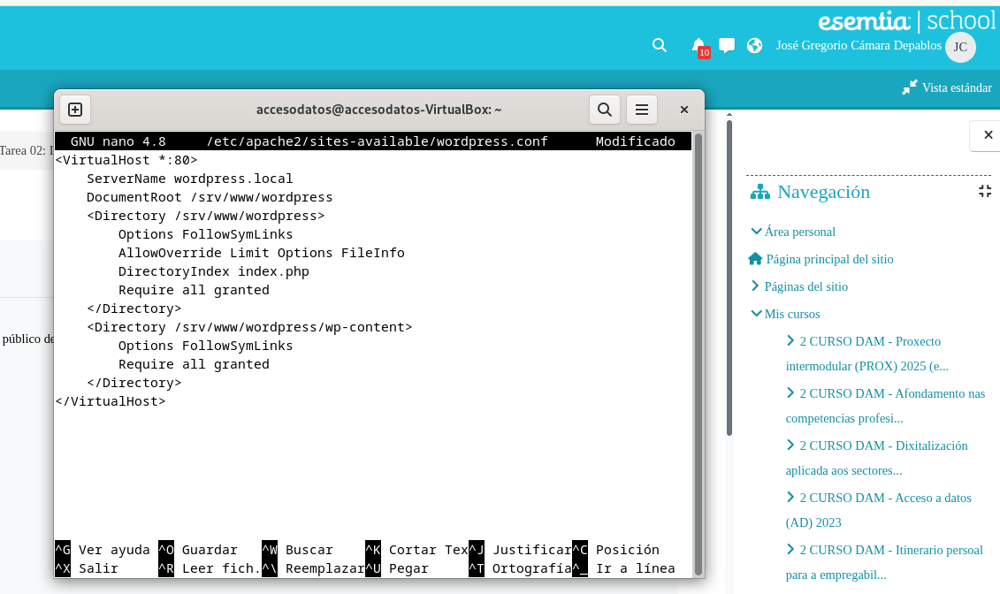
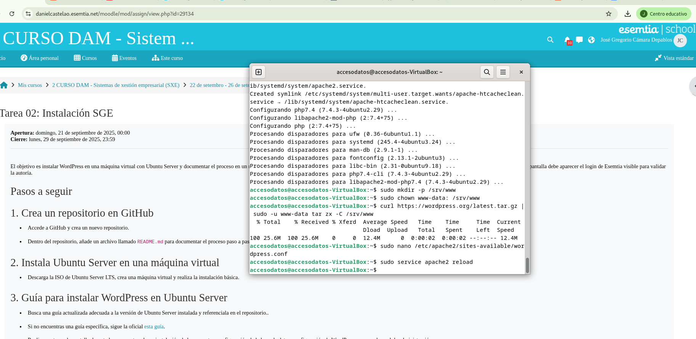
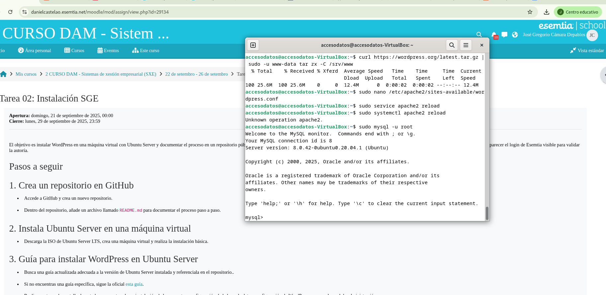
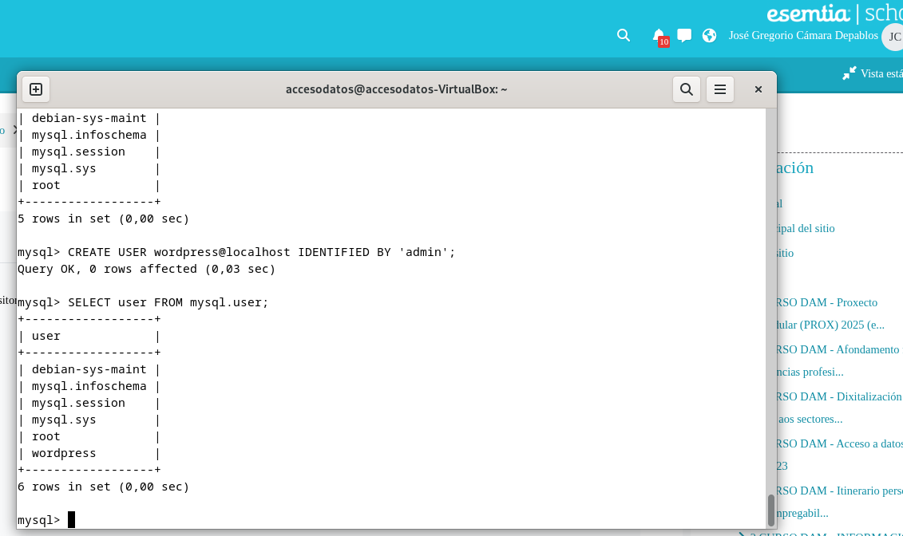
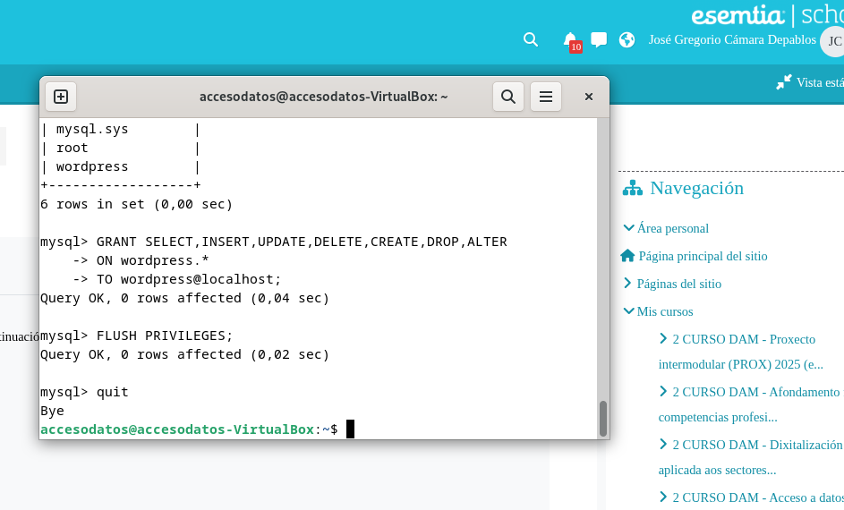

## Instalación de Servicio WordPress
En este README se explicará brevemente como realizar todos los pasos necesarios para realizar una puesta en marcha de un servicio WordPress.


## Índice

* [Descripción General](#Instalación-de-Servicio-WordPress)

* [Instalación de Dependencias](#Instalación-de-Dependencias)

* [Instalación de WordPress](#Instalación-de-WordPress)

* [Configurar Apache para WordPress](#Configurar-Apache-para-WordPress)

* [Configurar la Base de Datos](#Estado-del-proyecto)

* [Configurar la conexión entre la BBDD y WordPress](#Características-de-la-aplicación-y-demostración)

* [Configurar el WordPress](#acceso-proyecto)

* [Realizar tu Primer Post!](#tecnologías-utilizadas)

* [Personas-Desarrolladores del Proyecto](#personas-desarrolladores)

* [Documentación](#conclusión)


## Instalación de Dependencias

Para instalar Apache y PHP se tienen que utilizar los siguientes comandos:
    
```bash
sudo apt update
sudo apt install apache2 \
                 ghostscript \
                 libapache2-mod-php \
                 mysql-server \
                 php \
                 php-bcmath \
                 php-curl \
                 php-imagick \
                 php-intl \
                 php-json \
                 php-mbstring \
                 php-mysql \
                 php-xml \
                 php-zip
```
Aquí una captura de pantalla de como debería verse la terminal mientras instalan las dependencias necesarias:

 

## Instalación de WordPress
Crea el directorio de Instalación y descarga los archivos de **[WordPress.org](https://wordpress.org)**:

```bash
sudo mkdir -p /srv/www
sudo chown www-data: /srv/www
curl https://wordpress.org/latest.tar.gz | sudo -u www-data tar zx -C /srv/www
```

Captura de pantalla de como se ve el comando en la terminal:

 

 ## Configurar Apache para WordPress

Creamos el sitio de Apache con el siguiente comando:

```bash
sudo nano /etc/apache2/sites-available/wordpress.conf
```

Dentro del editor inyectamos las siguientes lineas de codigo:

```bash
<VirtualHost *:80>
    DocumentRoot /srv/www/wordpress
    <Directory /srv/www/wordpress>
        Options FollowSymLinks
        AllowOverride Limit Options FileInfo
        DirectoryIndex index.php
        Require all granted
    </Directory>
    <Directory /srv/www/wordpress/wp-content>
        Options FollowSymLinks
        Require all granted
    </Directory>
</VirtualHost>
```

Guardamos con: Ctrl + O y cerramos con: Ctrl + X

Captura de pantalla de como se ve el editor de texto del terminal:

 

Seguido modificaremos el archivo de configuración por defecto para agregar un Hostname al que el WordPress respondera sus llamadas. Este nombre de host debe estar mapeado a tu caja de alguna manera, por ejemplo, a través de DNS, o mediante ediciones en los sistemas del cliente. Hay que agregar ServerName como se ve el siguiente ejemplo:

```bash
<VirtualHost *:80>
    ServerName hostname.example.com
    ... # the rest of the VHost configuration
</VirtualHost>
```
Captura de pantalla agregando esta linea al archivo:



Para finalizar la configuración del Apache, reiniciaremos el servicio para aplicar todos los cambios con el siguiente comando:

```bash
sudo service apache2 reload
```
Captura de pantalla aplicando el comando:



## Configurar la Base de Datos 

Para configurar la base de datos primero tenemos que crearla en MySQL, utilizaremos los siguientes comandos:

```bash
$ sudo mysql -u root
Welcome to the MySQL monitor.  Commands end with ; or \g.
Your MySQL connection id is 7
Server version: 5.7.20-0ubuntu0.16.04.1 (Ubuntu)

Copyright (c) 2000, 2017, Oracle and/or its affiliates. All rights reserved.

Oracle is a registered trademark of Oracle Corporation and/or its
affiliates. Other names may be trademarks of their respective
owners.

Type 'help;' or '\h' for help. Type '\c' to clear the current input statement.

mysql> CREATE DATABASE wordpress;
Query OK, 1 row affected (0,00 sec)

mysql> CREATE USER wordpress@localhost IDENTIFIED BY '<your-password>';
Query OK, 1 row affected (0,00 sec)

mysql> GRANT SELECT,INSERT,UPDATE,DELETE,CREATE,DROP,ALTER
    -> ON wordpress.*
    -> TO wordpress@localhost;
Query OK, 1 row affected (0,00 sec)

mysql> FLUSH PRIVILEGES;
Query OK, 1 row affected (0,00 sec)

mysql> quit
Bye
```
- Capturas de pantalla de la configuración de la base de datos:


<br>

<br>

