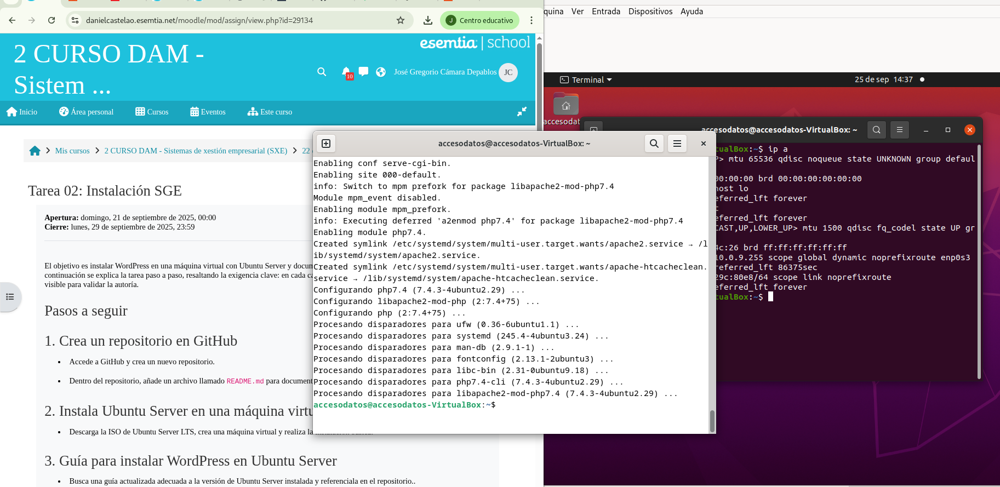
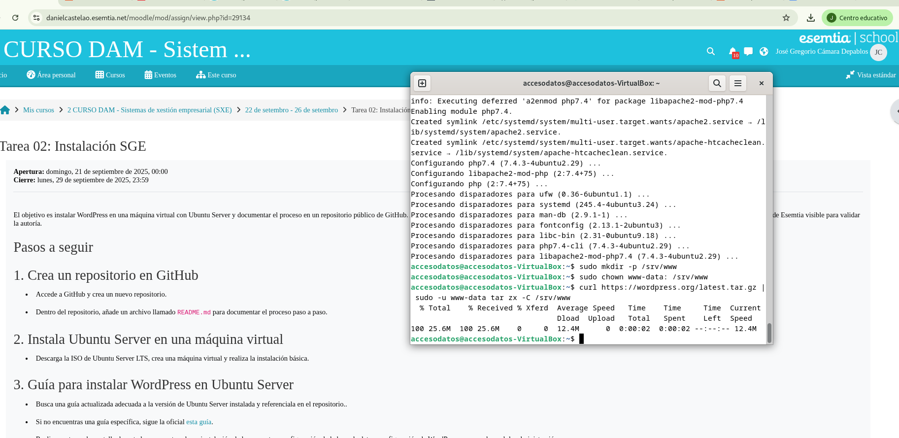

# Instalación de Servicio WordPress
En este README se explicará brevemente como realizar todos los pasos necesarios para realizar una puesta en marcha de un servicio WordPress.


# Índice

* [Descripción General](#Título-e-imagen-j-portada)

* [Instalación de Dependencias](#insignias)

* [Instalación de WordPress](#índice)

* [Configurar Apache para WordPress](#descripción-del-proyecto)

* [Configurar la Base de Datos](#Estado-del-proyecto)

* [Configurar la conexión entre la BBDD y WordPress](#Características-de-la-aplicación-y-demostración)

* [Configurar el WordPress](#acceso-proyecto)

* [Realizar tu Primer Post!](#tecnologías-utilizadas)

* [Personas-Desarrolladores del Proyecto](#personas-desarrolladores)

* [Documentación](#conclusión)


## Instalación de Dependencias
Para instalar Apache y PHP se tienen que utilizar los siguientes comandos:
    
```bash
sudo apt update
sudo apt install apache2 \
                 ghostscript \
                 libapache2-mod-php \
                 mysql-server \
                 php \
                 php-bcmath \
                 php-curl \
                 php-imagick \
                 php-intl \
                 php-json \
                 php-mbstring \
                 php-mysql \
                 php-xml \
                 php-zip
```
Aquí una captura de pantalla de como debería verse la terminal mientras instalan las dependencias necesarias:

 

## Instalación de WordPress
Crea el directorio de Instalación y descarga los archivos de **[WordPress.org(https://wordpress.org/)**:

```bash
sudo mkdir -p /srv/www
sudo chown www-data: /srv/www
curl https://wordpress.org/latest.tar.gz | sudo -u www-data tar zx -C /srv/www
```

Captura de pantalla de como se ve el comando en la terminal:

 
